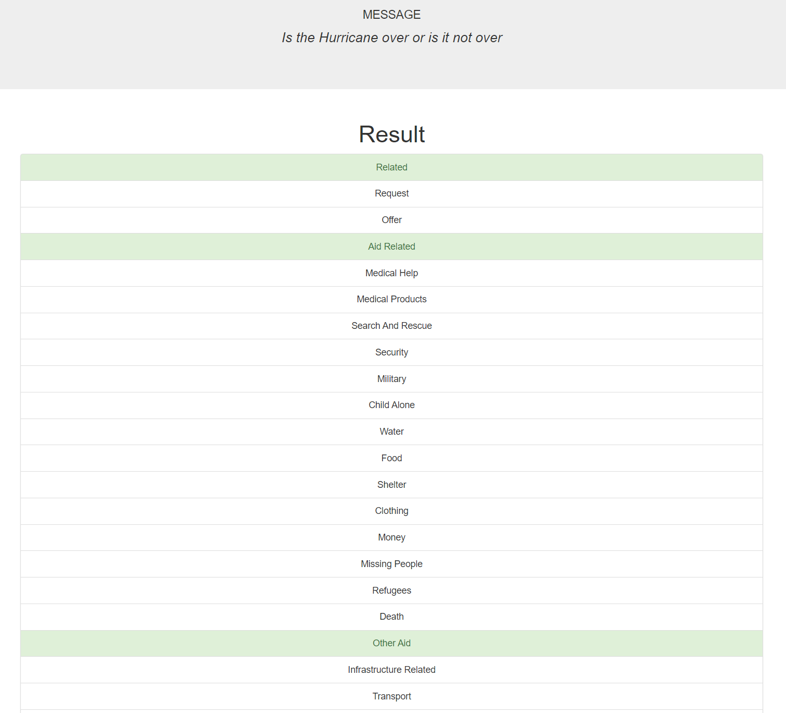

## Disaster-Response-Pipeline
In this project, I will apply some of the skills I learned through the Data Engineering course provided by Udacity to analyze disaster data from <a href="https://www.appen.com/"><strong>Appen</strong></a>, to build a robust machine learning pipeline capable of categorizing disaster messages so that we can send these messages to the appropriate disaster relief agency. The dataset comprises real messages sent during various disaster events, presenting a unique opportunity to apply data engineering and machine learning techniques in a critical, real-world scenario.    
Udacity were making sure to make this project accessible and user-friendly, they provided a web application where emergency workers can input new messages and receive real-time classification results. Additionally, the web app will feature visualizations of the data, providing valuable insights into the distribution and frequency of different disaster-related messages.

## Project Motivation 
In times of disaster, timely and accurate communication is critical for effective response and relief efforts. During such events, a massive volume of messages and information is generated, which can overwhelm relief agencies and delay critical response actions. By leveraging the power of data science and machine learning, we can automate the classification of these messages, ensuring that they reach the appropriate disaster relief agencies quickly and efficiently. This project aims to develop a machine learning model and an associated web application to classify disaster-related messages, thereby improving the speed and accuracy of disaster response.

## Table of contents
- [Project Motivation](#motivation)
- [Installation](#installation)
- [File Descriptions](#files)
- [How to Interact](#interaction)
- [Results](#results)
- [Licensing, Authors, Acknowledgements](#licensing)

## Installation 
The whole project is provided above as Python scripts, it should work properly in the terminal but you might need to install some libraries like:    
  - <a href="https://numpy.org/install/"><strong>numpy</strong></a>  
  - <a href="https://pandas.pydata.org/pandas-docs/stable/getting_started/install.html"><strong>pandas</strong></a>  
  - <a href="https://flask.palletsprojects.com/en/3.0.x/installation/"><strong>flask</strong></a>  
  - <a href="https://pypi.org/project/plotly/"><strong>plotly</strong></a>  
  - <a href="https://pypi.org/project/nltk/"><strong>nltk</strong></a>  
  - <a href="https://pypi.org/project/scikit-learn/"><strong>scikit-learn</strong></a>  
  
## File Descriptions 
There are three main components in this project.  
- The ETL Pipeline (process_data.py), this script will load the messages and the categories datasets, merge them, clean the data, and finally store it in a SQLite database.
- The ML Pipeline (train_classifier.py), this script will load data from the SQLite database, split the dataset into training and test sets, build a text processing and machine learning pipeline, train and tune a model using GridSearchCV, output results on the test set, exports the final model as a pickle file.
- The Flask Web App (run.py), this script should run the project together and provide you with a web app to interact and visualize some important information about the dataset.  
Finally, all the files are well commented so it should be easy to understand. 

## How to Interact 
In your terminal.  
1. Run the following commands in the project's root directory to set up your database and model.
   - To run ETL pipeline that cleans data and stores in database
        `python data/process_data.py data/disaster_messages.csv data/disaster_categories.csv data/DisasterResponse.db`
   - To run ML pipeline that trains classifier and saves
        `python models/train_classifier.py data/DisasterResponse.db models/classifier.pkl`
2. Go to `app` directory: `cd app`
3. Run your web app: `python run.py`
4. The script will give you a link that can be opened with your web browser

## Results 
Once you open the web app you can see two key visualizations on the application's homepage:
1. Distribution of Message Genres:
   - This bar chart displays the count of messages across three genres: direct, news, and social. The majority of the messages are categorized as 'news', followed by 'direct' messages, with 'social' being the least common genre.
2. Distribution of Message Categories:
   - This bar chart illustrates the count of messages for each disaster-related category. The 'related' category has the highest number of messages, indicating that most messages are relevant to disaster response. Other significant categories include 'aid-related', 'weather-related', and 'direct-report'.

**Message Classification**  
When a new message is input into the system, the model predicts the classification across various categories. For example, given the message "Is the Hurricane over or is it not over," the model identifies relevant categories such as 'Related', 'Aid Related', 'Other Aid', 'Weather Related', and 'Storms'. This multi-label classification ensures that all aspects of the message are considered, facilitating accurate and efficient disaster response.

## Licensing, Authors, Acknowledgements 
- This project is an open-source project. You are free to use, modify, and distribute the code and data, provided that proper credit is given to the original authors.  
- This project was created by (Jawad Kalthoom), an AI student currently pursuing a data science nanodegree. You can reach out to me on <a href="https://www.linkedin.com/in/jawad-kalthoom/"><strong>LinkedIn</strong></a> or <a href="https://github.com/JKalthoom"><strong>GitHub</strong></a> for any questions or collaborations.  
- Finally, I would like to thank Appen for the dataset and for making it accessible, and my instructors from Udacity for their guidance.
